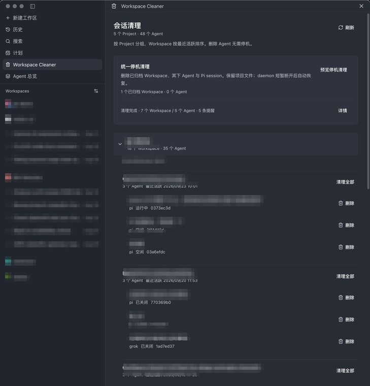

# Paseo Workspace Cleaner

Paseo 插件，批量清理已归档的 Workspace 和 Agent：从 History 硬删除单个 Agent，或统一停机删除所有已归档 Workspace 连同其下 Agent 与 Pi session。



清理页按 Project 分组，每个 Workspace 展开后列出 Agent 与状态，行内按钮删除单个 Agent，顶部统一停机清理卡片集中处理所有已归档 Workspace。截图里的会话标题做了打码。

## 能做什么

- 从 History 硬删除单个 Agent，可选同时移除对应 Pi session
- 在线清理：归档 Workspace 并清理其下 Agent，不停机
- 统一停机清理：一次删除所有已归档 Workspace、其下 Agent 和 Pi session，由独立维护进程执行，插件或 daemon 正常停止后继续跑
- 同一 Pi session 仍被其他 Agent 引用时自动保留
- Pi session 优先进系统废纸篓，废纸篓命令不可用时改名隔离，不直接永久删除
- Settings → Plugins → Workspace Cleaner 里调整清理默认值，查看停机删除为何不可用的只读诊断

清理入口都是浮层，不开新标签页：Workspace header 的垃圾桶按钮、Command Center 两项、composer 里的 `/clean`、清理页行内按钮。header 浮层另提供「仅已关闭（N）」，只删除已归档或已关闭的 Agent，不碰 idle 与 running。范围卡先列出将被删除的每个 Agent，确认弹窗是第二道闸。

## 兼容性

插件加载要求 Paseo >= 0.8.0，截至 2026-09 在 0.9.1 上实测正常。停机删除另有一道更严的闸门：只在 0.8.x 放开，唯一来源是 `shared/maintenance.ts` 的 `SUPPORTED_PASEO_MINOR`，版本闸门、维护进程连接声明与设置页诊断都从它读取。0.9.x 上在线清理和单 Agent 删除正常工作，停机删除在设置页诊断中说明未放开的原因，重新验证后再抬高这个常量。

## 停机删除怎么跑

Paseo 没有公开的 Workspace 永久删除协议，插件也不能改写 History 页面。停机删除做成独立维护进程：

1. 将 Workspace 注册表和目标 Agent 元数据备份到 `<PASEO_HOME>/workspace-cleaner/<任务 ID>/`，权限仅限当前用户。不备份时间线，官方 Agent 删除不可由这些备份完整撤销。
2. 在线逐个调用绑定本机 daemon 的 `paseo agent delete <完整 ID> --json`，核验 ID、数量、列表及实际存储。任何失败都停止后续清理。
3. 再检查全部 Agent 与定时任务，然后 `paseo daemon stop --home ...`，不使用 `--force`。确认原 PID 退出、无替代 daemon、端口关闭后重读并备份注册表，只移除仍保持原状且无剩余 Agent 引用的目标行，其他字段与行保留，原子替换写回。
4. 停机状态下重新检查剩余 Agent 对 Pi session 的引用，然后同步清理目标 session。保留项目目录、Git worktree、其他 provider 的原生 session。
5. 在 `finally` 中按原 home、监听地址和 Desktop 管理方式尝试启动，核对 server ID、连接及注册表。启动失败保留任务锁，状态为「需要人工恢复」，不显示成功。

执行前提是整个 daemon 没有运行中、初始化中、活动轮次或待授权 Agent，没有启用的定时任务 / heartbeat 或尚未结束的定时运行。归档清单由后台独立解析，前端仅提交预览指纹，归档清单或关联 Agent 变化就拒绝旧确认，不静默扩大范围。清理任务互斥。

Paseo 没有对其他客户端公开的维护锁，「空闲检查到停止」之间无法保证完全无竞态。确认后不要从其他客户端发消息、启动 Agent、启用定时任务，也不要手动启动另一个 daemon。宿主系统关机或维护进程被强制终止时，无法保证自动恢复。

恢复异常先查看任务目录内 `result.json` 和 `request.json`，确认实际删除项与 daemon 状态。先恢复 daemon，再人工核实无维护进程运行后处理 `maintenance.lock`，不要仅删除锁然后重试。`workspaces.stopped.json` 是注册表恢复参考，恢复也必须在 daemon 停止后进行，避免覆盖新记录。不会自动重试删除或自动覆盖备份。

## 安装

```bash
npm install
npm run test
npm run typecheck
npm run build
paseo plugin install /absolute/path/to/paseo-workspace-cleaner
paseo plugin ls
```

`paseo plugin ls` 必须为 `running`，异常时看 `paseo plugin logs paseo-workspace-cleaner`。

插件后端会调用同一台 daemon 上的 `paseo agent delete`。`paseo` 不在 daemon 的 `PATH` 时，用 daemon 环境变量 `PASEO_CLI_PATH` 指定绝对路径，实际生效的值与来源可在设置页诊断中确认。

## 开发

0.8 的编译边界由目录决定：

```text
index.client.tsx          # App 侧入口：侧边栏、Command Center、设置页、header 按钮、/clean
index.server.ts           # daemon 子进程入口：注册 settings 与全部 RPC handler
client/                   # 只编译进 App bundle
server/                   # 只编译进 daemon bundle：cleanup / maintenance / diagnostics / 维护进程
shared/                   # 两侧共用：Zod 契约、settings 定义、纯值与纯函数
dist/maintenance.mjs      # esbuild 产出的独立维护进程
```

源码改动后先测试、类型检查、构建，再 `paseo plugin reload paseo-workspace-cleaner`，无需重启 daemon。

安全诊断：`node dist/maintenance.mjs --check` 只读检查当前归档范围及阻止条件，`--probe` 只验证进程能启动，不接触 daemon。设置页的「停机删除可用性」同样只读，只跑 `paseo daemon status` 并读上次任务结果。单元测试使用临时目录和注入的生命周期，不在真实用户数据上执行停机或删除。
